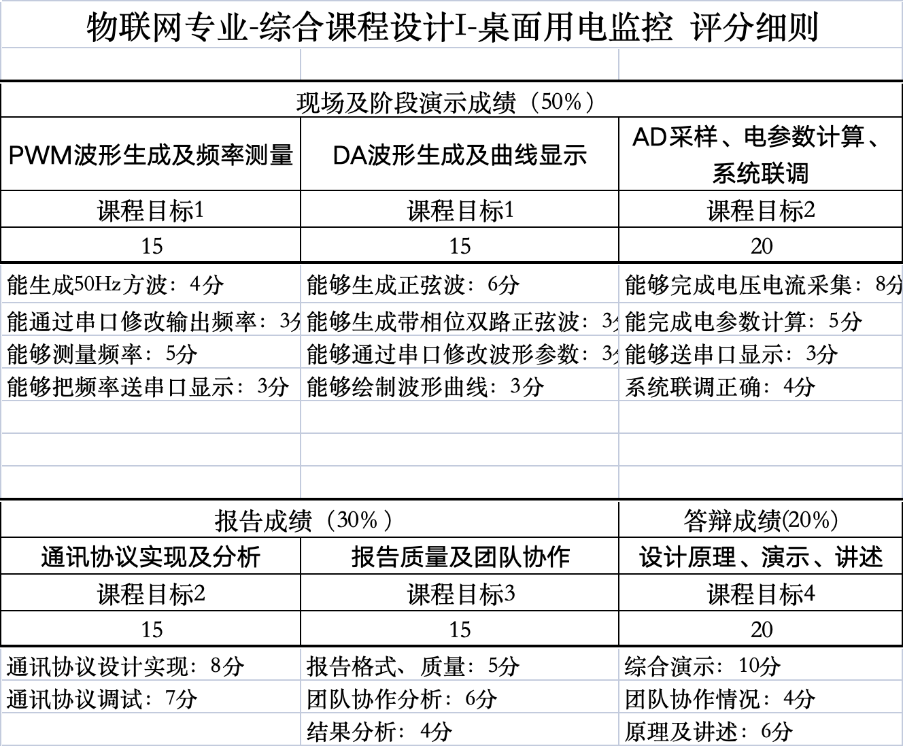

## 桌面用电监控系统



## 功能列表

- PWM 波形生成：PA8/TIM1_CH1 输出 50% 占空比方波，默认 50 Hz，可通过 LCD 按键或串口命令修改频率。
- PA1 频率测量：PA1/TIM2_CH2 输入捕获测量外部频率，结果显示在 LCD 和 `STATUS?` 串口响应中。
- DA 波形生成：PA4/PA5 双路 DAC 使用 TIM6 TRGO 触发，DMA2_CH3/CH4 循环输出 128 点正弦表。
- DA 曲线显示：LCD 的 `DA Wave` 页面显示 DAC 模式、频率、幅值、相位，并绘制 CH1/CH2 两路曲线和坐标轴。
- ADC 采样与电参数计算：PC0/PC3/PC2（ADC1_IN10/IN13/IN12）三通道模拟输入，TIM3 TRGO 以 6400 Hz 触发 ADC1 规则组扫描。DMA1_Channel1 循环搬运 384 半字，DMA TC 中断解交错到三个独立通道数组。Rust 定点数算法计算 Vrms、Irms、漏电流 Irms、有功功率、视在功率和功率因数。
- USART1 协议：通过 PA9/PA10、115200 8N1 接收命令，支持状态查询、自动上报开关、PWM 和 DAC 参数设置。
- 板级保护：启动时拉高 PC13、PA2、PA3 片选信号，避免触摸/W25Q64/SD 等共享外设误响应。

LCD 主菜单包含六个页面：

- `Dashboard`：主仪表盘页面，集中显示核心电参量（Vrms、Irms、功率、功率因数等）以及电压/电流的实时 ADC 采样波形。
- `Test Menu`：顶层测试菜单，包含 miniIO 继电器控制与引脚测试状态等。
- `PWM`：方波设置页，可查看并编辑 PA8 PWM 的频率。
- `Freq Measure`：测频页，可查看 PA1 频率测量结果，并包含串口自动上报开关。
- `DA Wave`：DAC 波形监看页，可查看 PA4/PA5 DAC 参数配置并实时绘制双通道波形。
- `System Info`：系统信息页，展示系统的编译与状态元数据。

## 串口协议

串口参数为 `115200 8N1`，协议为二进制帧。

帧格式：

```text
SOF0 SOF1 VER TYPE SEQ LEN_L LEN_H PAYLOAD... CRC_L CRC_H
```

字段约定：

- `SOF0=0xA5`，`SOF1=0x5A`：帧起始头。
- `VER=0x01`：协议版本。
- `TYPE=0x01`：上位机发给设备的命令帧。
- `TYPE=0x81`：设备返回给上位机的命令响应帧。
- `TYPE=0x82`：设备主动发送的自动上报或事件帧。
- `TYPE=0x83`：设备返回的协议错误帧，payload 通常为 `ERR BAD_FRAME`。
- `TYPE=0x84`：设备分帧发送的屏幕截图数据帧（调试辅助功能，见末尾「屏幕截图」）。
- `SEQ` 是请求序号；命令响应沿用请求帧的 `SEQ`，自动上报和启动事件使用 `0`。
- `LEN_L/LEN_H` 是 payload 字节数，小端 `uint16`。
- `CRC_L/CRC_H` 是 CRC-16/Modbus，小端，覆盖 `VER` 到 `PAYLOAD`，不覆盖 `SOF0/SOF1`。

payload 是不带 `NUL`、不带 `CRLF` 的可打印 ASCII 文本：

```text
HELP
STATUS?
REPORT?
REPORT ON
REPORT OFF
PWM SET <hz>
DAC SET MODE SINGLE|DUAL
DAC SET FREQ <hz>
DAC SET AMP <code>
DAC SET PHASE <deg>
SHOT
```

说明：

- `STATUS?` 返回 PA1 测频、PWM 频率、上报开关、DAC 模式/频率/幅值/相位、以及 ADC 电参数（Vrms/Irms/漏电流/有功功率/视在功率/功率因数）。
- `HELP` 会返回多条 `TYPE=0x81` 响应帧，每条响应帧使用同一个 `SEQ`。
- `DAC SET MODE SINGLE` 时，CH1 输出正弦波，CH2 保持 DAC 中点电压。
- `DAC SET MODE DUAL` 时，CH1/CH2 输出同频同幅正弦波，CH2 相对 CH1 使用 `DAC SET PHASE` 指定相位差。
- `DAC SET FREQ` 当前限制在 1..1000 Hz，`DAC SET AMP` 当前限制到安全码值范围内。
- `SHOT` 是调试辅助命令（不在 `HELP` 列表中）：设备把当前 LCD 画面按 RLE 十六进制文本经 `TYPE=0x84` 帧分块上传，由上位机 `shot` 工具重建为 PNG。
- 设备启动后会主动发送 `TYPE=0x82, SEQ=0, PAYLOAD="OK COURSE1 READY"`。
- CRC 错误、帧不完整或 SOF 噪声会被静默丢弃；版本、类型或 payload 长度不合法时返回协议错误帧。

`STATUS?` 响应格式示例：

```text
OK STATUS MEAS=50.00Hz PWM=50Hz REPORT=ON DAC_MODE=SINGLE DAC_FREQ=50Hz DAC_AMP=1500 DAC_PHASE=0 VRMS=220.12 IRMS=1.234 ILK=0.005 P=220.1 S=271.5 PF=0.810
```

`STATUS?` 命令帧示例，`SEQ=0x2A`：

```text
A5 5A 01 01 2A 07 00 53 54 41 54 55 53 3F B4 59
```

其中 `53 54 41 54 55 53 3F` 是 ASCII payload `STATUS?`，`B4 59` 是对 `01 01 2A 07 00 53 54 41 54 55 53 3F` 计算得到的 CRC-16/Modbus。

## 串口命令行工具

`tools/serial_cmd/` 是一个 Rust 编写的串口命令工具，自动完成二进制帧封装和 CRC 校验。

编译：

```sh
cd tools/serial_cmd
cargo build --release
```

编译产物位于 `tools/serial_cmd/target/release/serial_cmd`。

### 发送命令

```sh
# 查询状态
serial_cmd /dev/cu.usbserial-10 "STATUS?"

# 查看帮助
serial_cmd /dev/cu.usbserial-10 "HELP"

# 修改 PWM 频率
serial_cmd /dev/cu.usbserial-10 "PWM SET 1000"

# 开关自动上报
serial_cmd /dev/cu.usbserial-10 "REPORT ON"
serial_cmd /dev/cu.usbserial-10 "REPORT OFF"

# DAC 参数设置
serial_cmd /dev/cu.usbserial-10 "DAC SET MODE DUAL"
serial_cmd /dev/cu.usbserial-10 "DAC SET FREQ 80"
serial_cmd /dev/cu.usbserial-10 "DAC SET AMP 1900"
serial_cmd /dev/cu.usbserial-10 "DAC SET PHASE 180"
```

`REPORT ON` 发送后会自动进入 5 秒监听，显示后续自动上报内容。

### 监听模式

持续接收设备的自动上报和事件帧：

```sh
serial_cmd /dev/cu.usbserial-10 monitor
```

按 `Ctrl+C` 退出。

### CRC 校验测试

```sh
cargo run --release --bin crc_test -- /dev/cu.usbserial-10
```

该测试会分别发送正确 CRC 帧、破坏 CRC 帧和篡改 payload 帧，验证设备端 CRC 校验是否正常工作。

### 屏幕截图

把当前 LCD 画面通过串口截取为 PNG（240×320，调试辅助功能）：

```sh
cargo run --release --bin shot -- /dev/cu.usbserial-110 screenshot.png
# 或直接使用编译产物：
./target/release/shot /dev/cu.usbserial-110 screenshot.png
```

参数依次为：串口、输出文件名、可选超时秒数（默认 30）。设备收到 `SHOT` 命令后，把 LCD 画面按 RLE 压缩编码为十六进制文本，经 `TYPE=0x84` 帧分块上传，`shot` 工具重建为 PNG。截图期间主循环会冻结数秒，传完自动恢复。切换 LCD 页面需使用开发板实体按键（串口无翻页命令）。

## 项目结构

- `core/`：启动后的 C 入口、中断文件、`SystemInit`。
- `bsp/`：板级支持代码，包括延时、系统兼容头文件等。
- `middleware/alientek_lcd/`：ALIENTEK TFT LCD 驱动。
- `app/`：应用层模块，包含 LCD 菜单显示、USART1 协议、DAC 波形、PWM 输出、PA1 输入捕获测频、ADC 采样与电参数计算等功能。
- `rust_algos/`：`no_std` Rust 静态库，供 C 主工程链接。
- `linker/`：STM32F103RCT6 的 Flash/RAM 链接脚本。
- `startup/`：启动汇编文件。
- `tools/openocd/`：OpenOCD 烧录配置。
- `tools/serial_cmd/`：Rust 串口命令行工具，封装二进制帧协议和 CRC 校验。
- `report/`：LaTeX 课程设计报告（`main.tex`，xelatex/latexmk 构建），图片位于 `report/figures/`。

## 环境要求

确保以下工具可用：

- CMake、`arm-none-eabi-gcc`
- Rust Toolchain、cbindgen
- OpenOCD、Python 3（可选）

Rust 嵌入式目标只需安装一次：

```sh
rustup target add thumbv7m-none-eabi
```

如果要使用串口烧录，需要安装 `stm32loader`：

```sh
python3 -m pip install --user pyserial stm32loader
```

安装 `cbindgen`：

```sh
cargo install --force cbindgen
```

## 构建与烧录

配置并构建 Debug 版本：

```sh
cmake --preset Debug
cmake --build --preset Debug -j4
```

生成的 ELF 文件位于：

```text
build/Debug/desktop_power_monitor.elf
```

如需串口烧录使用的 BIN 文件，执行：

```sh
arm-none-eabi-objcopy -O binary \
  build/Debug/desktop_power_monitor.elf \
  build/Debug/desktop_power_monitor.bin
```

### 使用 ST-Link 烧录

连接 ST-Link 后执行：

```sh
openocd -f tools/openocd/stm32f103rct6.cfg \
  -c "program build/Debug/desktop_power_monitor.elf verify reset exit"
```

### 使用串口烧录

查看当前串口设备：

```sh
python3 -m serial.tools.list_ports -v
```

烧录命令示例：

```sh
/Users/uednd/Library/Python/3.9/bin/stm32loader \
  -p /dev/tty.usbserial-110 \
  -b 115200 \
  -f F1 \
  -e -w -v \
  -g 0x08000000 \
  build/Debug/desktop_power_monitor.bin
```

串口烧录前需要让芯片进入系统 Bootloader：将 `BOOT0` 置 1 后复位。烧录完成后，将 `BOOT0` 置回 0 并复位运行用户程序。

## Rust/C 接口与 cbindgen

本工程使用 C + Rust 混合编写。Rust 主要用于编写算法，位于 `rust_algos/`，通过 `staticlib` 形式编译为静态库，再由 CMake 链接进 STM32 固件。

Rust 暴露给 C 调用的函数需要满足以下约定：

- 使用 `pub extern "C" fn` 固定为 C ABI。
- 使用 `#[no_mangle]` 保持符号名不被 Rust 编译器改写。
- FFI 边界优先使用 `u32`、`i32`、指针等 C 侧明确可表达的类型。
- 导出结构体或枚举需要使用 `#[repr(C)]` 固定内存布局。

当前 Rust 算法库导出以下接口：

| 函数 | 用途 |
|------|------|
| `pm_calc_electrical(v, i, ilk, count, ...)` | 从三通道 ADC 样点计算 Vrms/Irms/漏电流/P/S/PF |

生成规则位于：

```text
rust_algos/cbindgen.toml
```

正常执行 CMake 构建时，如果系统中存在 `cbindgen`，会自动刷新头文件：

```sh
cmake --build --preset Debug -j4
```

也可以手动生成：

```sh
cd rust_algos
cbindgen --config cbindgen.toml --crate rust_algos --output include/rust_algos.h
```

检查当前头文件是否与 Rust 源码一致：

```sh
cd rust_algos
cbindgen --config cbindgen.toml --crate rust_algos --output include/rust_algos.h --verify
```

新增 Rust 导出接口时，推荐流程是：

1. 在 `rust_algos/src/lib.rs` 中添加 `#[no_mangle] pub extern "C" fn ...`。
2. 为该函数添加 Rust 文档注释，`cbindgen` 会把注释同步到 C 头文件。
3. 运行 CMake 构建或手动运行 `cbindgen` 生成 `rust_algos.h`。
4. 在 C 代码中包含 `rust_algos.h` 并调用新接口。
